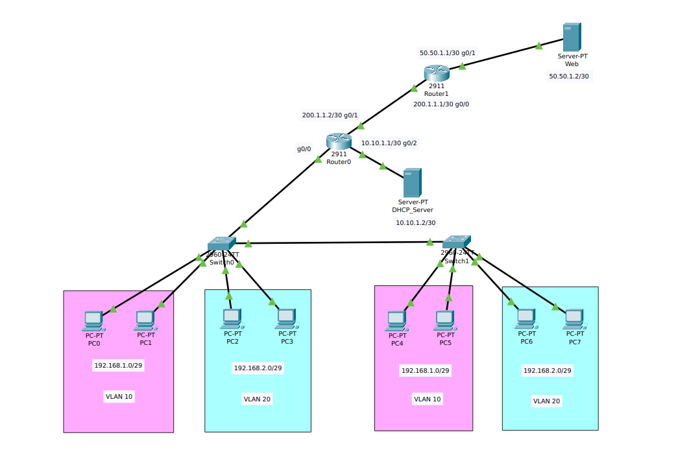

# Enterprise Network Lab (Packet Tracer)

This project demonstrates the implementation of an **enterprise-level network** using **Cisco Packet Tracer**, covering core networking concepts:

## 🔹 Features Implemented
- VLAN segmentation (VLAN 10 & VLAN 20)
- Inter-VLAN Routing (Router-on-a-Stick)
- DHCP with helper-address (centralized DHCP server)
- NAT (Network Address Translation) for internet access
- Static Routing between Enterprise Router and ISP Router
- Web Server hosted behind ISP
- Switch trunking for VLAN propagation

## 🔹 Network Topology

## 🔹 IP Addressing Scheme
| Device       | Interface        | IP Address     | Description       |
|--------------|-----------------|----------------|------------------|
| Router0      | G0/0.10         | 192.168.1.1/29 | VLAN 10 Gateway  |
| Router0      | G0/0.20         | 192.168.2.1/29 | VLAN 20 Gateway  |
| Router0      | G0/1            | 200.1.1.2/30   | To ISP Router    |
| Router0      | G0/2            | 10.10.1.1/30   | To DHCP Server   |
| Router1 (ISP)| G0/0            | 200.1.1.1/30   | To Enterprise    |
| Router1 (ISP)| G0/1            | 50.50.1.1/30   | To Web Server    |
| DHCP Server  | NIC             | 10.10.1.2/30   | DHCP Services    |
| Web Server   | NIC             | 50.50.1.2/30   | Public Webserver |

## 🔹 Technologies Used
- **Switching:** VLANs, Trunking
- **Routing:** Inter-VLAN Routing, Static Routing
- **Services:** DHCP, NAT, Web Server
- **Topology Type:** Extended Star with ISP connection

## 🔹 Configurations
All router & switch configurations are available in the `Configurations/` folder.

---

### 🔹 Learning Outcome
This project gave me hands-on practice with:
- Designing enterprise network topology
- Implementing VLANs & trunk ports
- Using Router-on-a-Stick for Inter-VLAN routing
- DHCP relay & NAT configuration
- Static routing for WAN connectivity

---
